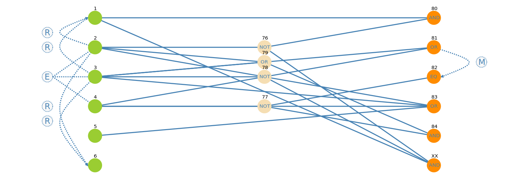

## 1. CEG

| Name  | Description                                                |    test1     | test2 |    test3     |        test4        |    test5     |    test6     |
| :---: | :--------------------------------------------------------- | :----------: | :---: | :----------: | :-----------------: | :----------: | :----------: |
|   -   | [Test Case ID]                                             |  [1]    [2]  |  [3]  |  [4]   [5]   |   [6]    [7]  [8]   |  [9]   [10]  | [12]   [13]  |
|   1   | Požiadavka na presun materiálu                             |   1      1   |   1   |   0      0   |    1      1    1    |   0      0   |   0      0   |
|   2   | Náklad v intervale (0,60> od vytvorenia požiadavky         |   1      1   |   0   |   0      0   |    0      0    0    |   0      0   |   0      0   |
|   3   | Náklad v intervale (60,120> od vytvorenia požiadavky       |   0      0   |   1   |   0      0   |    0      0    0    |   0      0   |   0      0   |
|   4   | Vozík obsahuje prioritný materiál                          |   0      0   |   0   |   1      1   |    0      0    0    |   0      0   |   1      0   |
|   5   | Vozík obsahuje neprioritný materiál                        |   0      1   |   1   |   1      1   |    0      1    1    |   0      0   |   0      1   |
|   6   | Vozík má voľnú kapacitu (voľný slot + vozík unesie náklad) |   1      1   |   1   |   1      0   |    0      1    0    |   0      1   |   0      0   |
|  80   | Materiál v požiadavke sa stáva prioritným                  | false  false | true  | false  false | true   true   true  | false  false | false  false |
|  81   | Vozík v režime iba_vykladka                                | false  false | true  | true   true  | false  false  false | false  false | true   false |
|  82   | Vozík v normálnom režime                                   | true   true  | false | false  false | true   true   true  | true   true  | false  true  |
|  83   | Vozík vyloží materiál                                      | true   true  | true  | true   true  | false  true   true  | false  false | true   true  |
|  84   | Vozík naloží materiál                                      | true   true  | true  | false  false | false  false  false | false  false | false  false |
|  XX   | Vyvolá sa výnimka X1                                       | false  false | false | false  false | true   true   true  | false  false | false  false |

## 2. Parametre:

| parameter         | popis                                                            |
| :---------------- | :--------------------------------------------------------------- |
| zdrojova zastavka | zdrojova zastavka poziadavky                                     |
| cielova zastavka  | cielova zastavka poziadavky                                      |
| cas od vzniku     | cas ktory uplynul od vzniku poziadavku                           |
| cas presunu       | cas potrebny na presun z aktualneho miesta do zdrojovej zastavky |
| volna kapacita    | hovori ci je volna kapacita pri dorazeni do zdrojovej zastavky   |
| iba vykladka      | hovori o tom aky je rezim pri dorazeni do zdrojovej zastavky     |

## 3. Charakteristiky

|   C0 | zdrojova zastavka poziadavky |
| ---: | :--------------------------: |
|    1 |              A               |
|    2 |              B               |
|    3 |              C               |
|    4 |              D               |

|   C1 | cielova zastavka poziadavky |
| ---: | :-------------------------: |
|    1 |              A              |
|    2 |              B              |
|    3 |              C              |
|    4 |              D              |

|   C2 | cas ktory uplynul od vzniku poziadavku |
| ---: | :------------------------------------: |
|    1 |                (0, 60>                 |
|    2 |               (60, 120>                |
|    3 |              (120, infty)              |

|   C3 | cas potrebny na presun z aktualneho miesta do zdrojovej zastavky |
| ---: | :--------------------------------------------------------------: |
|    1 |                             (0, 60>                              |
|    2 |                            (60, 120>                             |
|    3 |                           (120, infty)                           |

|   C4 | hovori ci je volna kapacita pri dorazeni do zdrojovej zastavky |
| ---: | :------------------------------------------------------------: |
|    1 |                              True                              |
|    2 |                             False                              |

|   C5 | hovori o tom ci je rezim pri dorazeni do zdrojovej zastavky iba-vykladka |
| ---: | :----------------------------------------------------------------------: |
|    1 |                                   True                                   |
|    2 |                                  False                                   |

**Constraints**

    C0.1 -> !C1.1
    C0.2 -> !C1.2
    C0.3 -> !C1.3
    C0.4 -> !C1.4
    C2.1 -> ( C3.1 and C4.1 and C5.2 )
    C2.2 -> ( ( C3.1 and (C4.2 or C5.1) ) or ( C3.2 and C4.1 and C5.2 ) )
    C2.3 -> ( C3.2 and ( C4.2 or C5.1 ) ) 

## 4. Combine Tabulka

| Test Case ID | C0   | C1   | C2           | C3        | C4    | C5    |
| :----------: | :--- | :--- | :----------- | :-------- | :---- | :---- |
|      1       | A    | B    | (0, 60>      | (0, 60>   | true  | false |
|      2       | A    | C    | (60, 120>    | (60, 120> | true  | false |
|      3       | A    | D    | (120, infty) | (60, 120> | false | true  |
|      4       | B    | A    | (0, 60>      | (0, 60>   | true  | false |
|      5       | B    | C    | (120, infty) | (60, 120> | false | true  |
|      6       | B    | D    | (60, 120>    | (0, 60>   | false | true  |
|      7       | C    | A    | (60, 120>    | (60, 120> | true  | false |
|      8       | C    | B    | (120, infty) | (60, 120> | false | true  |
|      9       | C    | D    | (0, 60>      | (0, 60>   | true  | false |
|      10      | D    | A    | (120, infty) | (60, 120> | true  | true  |
|      11      | D    | B    | (60, 120>    | (0, 60>   | false | false |
|      12      | D    | C    | (0, 60>      | (0, 60>   | true  | false |
|      13      | B    | A    | (60, 120>    | (0, 60>   | false | true  |
|      14      | A    | A    | (120, infty) | (60, 120> | false | false |

## 5. Testy

[**zoznam chyb**](errors.txt) - zoznam zdokumentovanych chyb

| Test ID | Testovaci scenár                                                                                       | Pokrytie Combine | Pokrytie CEG | Vysledok |
| :-----: | :----------------------------------------------------------------------------------------------------- | ---------------: | -----------: | :------: |
|    1    | **spracovanie** poziadavky **do minuty** od vytvorenia                                                 |         1,4,9,12 |          1,2 |    OK    |
|    2    | **naklad prioritneho materialu** & vylozenie materialu                                                 |          6,11,13 |  3,4,5,11,12 | FAILURE  |
|    3    | (**dlzka cesty** k materialu **viac ako minuta** => **material je prioritny**) a **stihne** sa nalozit |              2,7 |              | FAILURE  |
|    4    | **normalny rezim** ak stihnem spracovat a nepride nova poziadavka                                      |                  |         9,10 |    OK    |
|    5    | **nespracovanie poziadavky ani do dvoch minut** od vytvorenia **kvoli rezimu iba vykladka**            |               10 |            7 |    OK    |
|    6    | **nespracovanie poziadavky ani do dvoch minut** od vytvorenia **kvoli kapacite**                       |               14 |          6,8 |    OK    |
